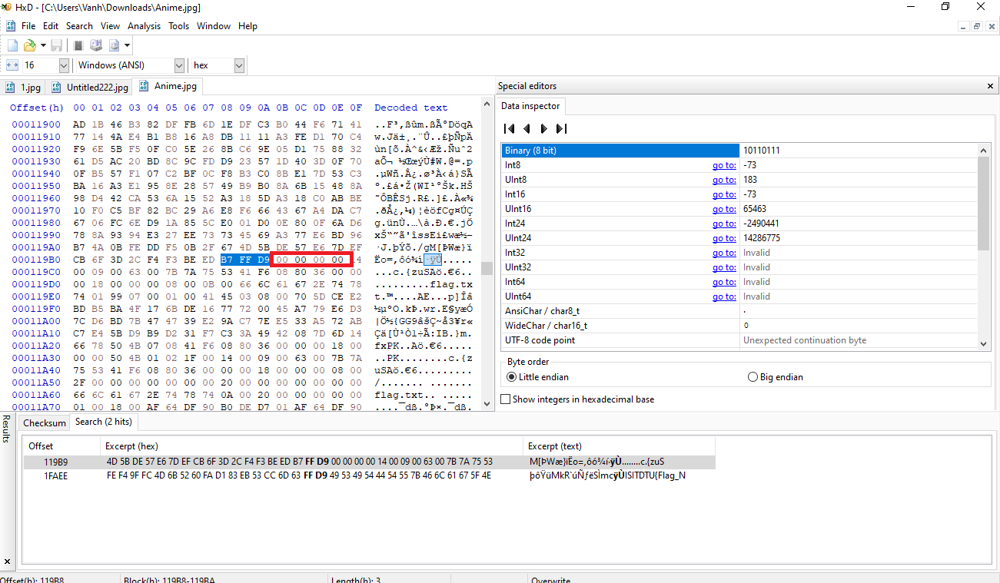
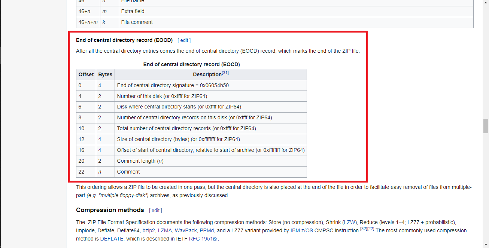
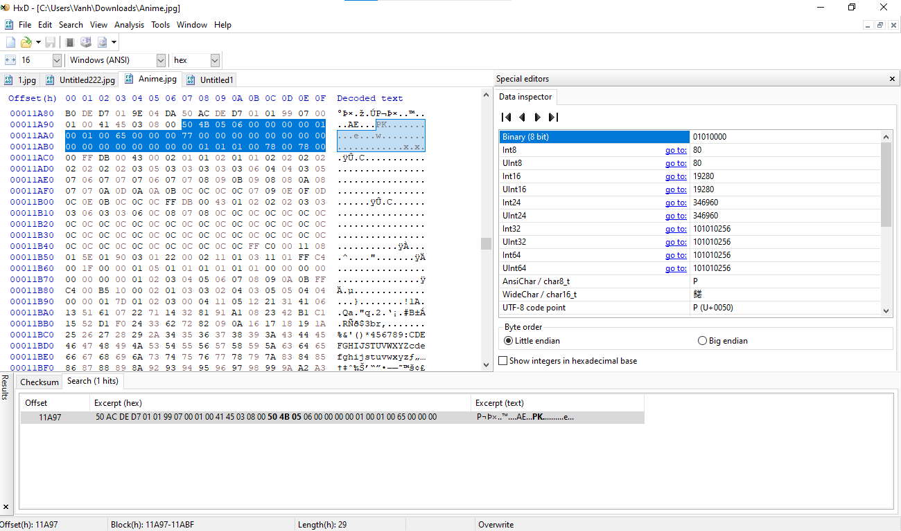
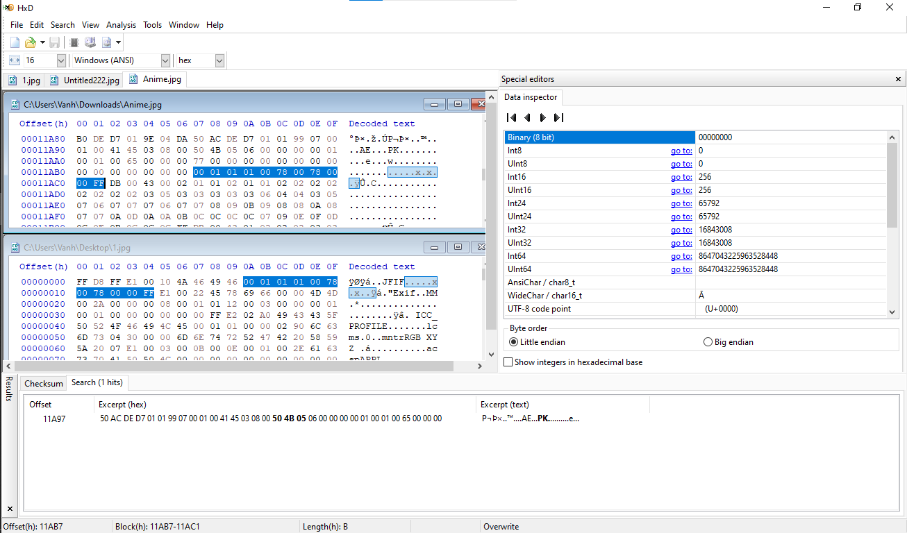
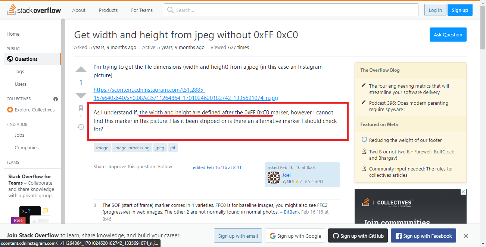
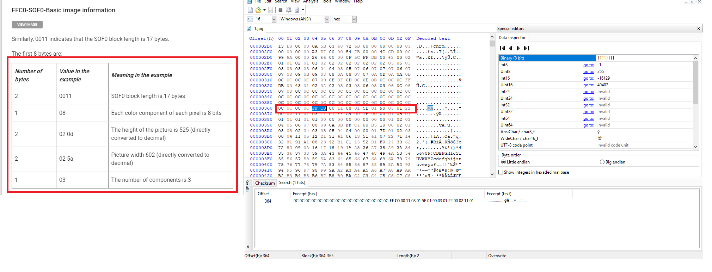
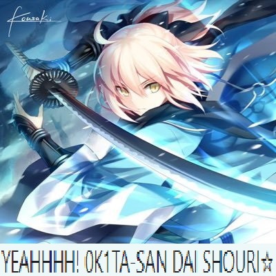
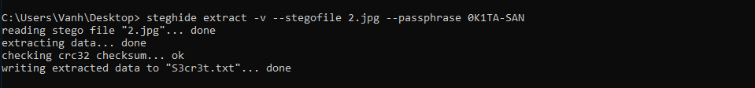

# WATASI WA...?
Do you know which universe this historical figure belongs to?
> 
### Solution
#### Part 1:
- Đầu tiên mình thử các tool cơ bản như stegsolve, exif, binwalk cho bức ảnh này và không có kết quả gì.
- Sau đó mình đã thử chuyển đuôi file .jpg thì .zip có kết quả, 1 file flag.txt trong đó nhưng file corrupt không thể giải nén.
- Sử dụng HxD để xem hex data của bức ảnh.
- File .jpg kết thúc với  ```FF D9```. Lần theo đó mình tìm được 2 kết quả như vậy.
> 
- Và ngay sau kết thúc của file .jpg mình nhận thấy dấu hiệu của file .zip 
- Một tệp .zip bình thường sẽ bắt đầu với ```50 4B 03 04``` phù hợp với số null bytes như trong hình trên. Hay nói cách khác đây là các null bytes giữ chỗ cho các header bytes của .zip
- Vùa nãy mình tìm thấy 2 phần kết thúc file của .jpg => có thể sau file zip này sẽ có 1 file jpg khác nữa.
- Đến với phần kết thúc của file zip nó sẽ nằm sau ```50 4B 05 06 ```
> 
- Mình tìm đến các bytes này và xuất hiện sau ```50 4B 05 06 ``` có rất nhiều null bytes.
> 
- Nghi ngờ về điều này mình đã mở file jpg đầu tiên tìm đã được mình tách ra xem các bytes đầu của bức ảnh này và có thể thấy nó có khá nhiều điểm tương đồng.
> 
- Từ đó => 10 null bytes trước phần bôi đen trong ```Anime.jpg``` là vị trí giữ chỗ cho 10 bytes đầu tiên của bức ảnh.
- Tách từ 10 null bytes cho đến ```FF D9``` và thay ```00 00 00 00 00 00 00 00 00 ``` -> ```FF D8 FF E1 00 10 4A 46 49 46``` và mình đã có được bức ảnh thứ 2.
- Kết thúc part 1 Anime.jpg -> jpg1 + zip + jpg2.
#### Part 2:
- Mở file zip đã tách được giải nén và nó yêu cầu password.
- Ban đầu mình đã nghĩ password chính là đáp án câu hỏi ở đề bài.
- Nhưng sau vô vàn lần thử và tìm kiếm file zip vẫn chưa được mở.
- Tới đây mình có hỏi admin về vấn đề này và nhận được hint
> Trên ảnh có ký tự
=> có thể có các pixel bị ẩn
- Sau khi google tìm hiểu chiều cao và chiều rộng bức ảnh nằm sau ```FF C0```
> 
- Tới đây mình tiếp tục tìm xem đâu là bytes quy định width and height của ảnh.
> 
- ```01 5E 01 90``` tương đương với chiều cao = ```01 5E(hex) = 350(dec) ``` và chiều rộng ``` 01 90(hex) = 400(dec) ```
- Mình đã thử tăng chiều cao ảnh lên 400 ```01 5E``` => ```01 90``` và 1 dòng chữ xuất hiện.
> 
- Mình đã thử giải nén file zip với những từ trong bức ảnh nhưng kết quả vẫn = 0.
- Đối với bức ảnh mình cũng đã thử chỉnh kích thước như trên nhưng không có dòng chữ nào ở đây cả.
- Mình đã nghĩ đến những thứ cần có password để mở và có 1 thứ khác là ```steghide```.
- Có thể có gì đó được dấu trong bức ảnh thứ 2 bằng steghide và password là từ nào đó trong bức ảnh thứ 1
- Sau vài lần thử thì mình đã extract được 1 file [S3cr3t.txt](Files/S3cr3t.txt) với nội dung: ```FG0!!!```
> 
- Cuối cùng, giải nén file zip với pass ```FG0!!!``` và nhận flag.
- ISITDTU{St3g0_15_Fun!!!}

